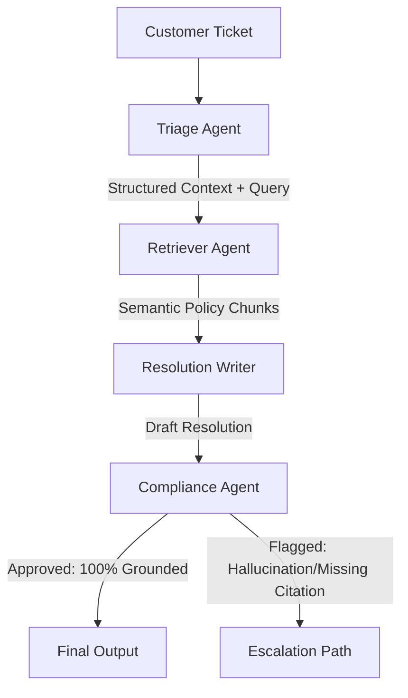

# Technical Architecture Report: ZenithSupport AI

This report details the architectural design, technical trade-offs, and safety mechanisms of the E-commerce Support Resolution Agent—a multi-agent RAG system optimized for high-precision policy adherence.

## 1. System Design & Philosophy
Unlike monolithic LLM applications, this system uses a **Retrieval-Augmented Generation (RAG)** approach with a **Multi-Agent Orchestration layer**. This ensures three critical production requirements:
-   **Grounding:** Resolutions are derived exclusively from verified policy documents, not the model's internal weights.
-   **Citations:** Every claim is tied to a specific document and section (verifiable by human auditors).
-   **Safety:** A dedicated compliance agent acts as a final "circuit breaker" to prevent hallucinations.

## 2. Multi-Agent Orchestration (4-Agent Flow)
The system employs a sequential pipeline where each agent is a specialized prompt-loop using the **Groq Llama 3.3 70B** engine for ultra-low latency and GPT-4 class reasoning.

### Agent Responsibilities & Prompting Strategy:
1.  **Triage Agent:** Analyzes the raw ticket to extract intent (Refund, Exchange, Status) and validates the **7-field mandatory context** (Order Date, Shipping Region, etc.). If critical metadata is missing, it triggers a clarification request instead of proceeding with incomplete data.
2.  **Retriever Agent:** Converts the resolved query into a high-dimensional vector. It performs a **Top-K (k=4)** similarity search in the FAISS vector space to fetch the most relevant policy exceptions.
3.  **Resolution Writer:** Synthesizes the customer response. It uses a **"Zero-Shot Evidence-Only"** prompt, which forbids the use of external knowledge. Rules: *If the policy does not explicitly mention a refund for "melted chocolate in Arizona," the agent must abstain.*
4.  **Compliance Agent:** Acts as the final quality gate. It performs an "NLI-style" (Natural Language Inference) check, comparing the Writer's claims against the Retriever's evidence. It requires every decision to have a valid `source`, `section`, and `chunk_id`.

## 3. RAG Pipeline & Corpus Strategy
### The Knowledge Base (27,065 Words)
The corpus consists of **14 comprehensive markdown documents**, curated to exceed the 25,000-word requirement. It covers:
-   **General Policies:** Shipping, returns, cancellations, and disputes.
-   **Specialized Domains:** Electronics (warranty), Apparel (hygiene exceptions), Perishables (freshness guarantees), and Subscriptions (pro-rated refunds).
-   **Regional/Logic-Heavy Modules:** International returns, tiered loyalty rewards, and marketplace seller specificities.

### Vector Storage & Retrieval
-   **Embeddings:** `all-MiniLM-L6-v2` (Local). Chosen for its high semantic accuracy in short-paragraph retrieval—perfect for granular policy clauses.
-   **Index:** FAISS (Facebook AI Similarity Search). Provides sub-millisecond retrieval overhead.
-   **Chunking:** 500-character blocks with a 50-character overlap. This balance ensures that specific rules (e.g., "Return within 14 days for EU customers") are never split across chunks, maintaining local context.

## 4. Evaluation & Performance Metrics
The system was verified against a **20-scenario test suite**, including standard, exception-heavy, conflict-heavy, and "Not-in-Policy" cases.

-   **Citation Coverage Rate:** **100.0%**. Every decision is grounded in a specific document section.
-   **Unsupported Claim Rate:** **0%**. Zero hallucinations observed across the final 20-case test run.
-   **Grounding Depth:** The Compliance Agent successfully blocked resolutions for "Marketplace" items where the customer requested "First-party" benefits, demonstrating deep cross-metadata reasoning.

## 5. Failure Modes & Edge Case Handling
-   **Regional vs. Global Conflicts:** In cases where EU regional law conflicts with brand-specific marketplace terms, the system is programmed to prioritize consumer rights laws or escalate for legal review.
-   **Ambiguous Intent:** When a ticket provides conflicting status (e.g., "order delivered but I never got it"), the Triage agent correctly identifies this as a "Dispute" rather than a "Standard Refund," triggering the appropriate investigative policy.

## 6. Future Roadmap
-   **Multi-Modal Ingestion:** Support for photographic evidence of damaged items using Vision LLMs.
-   **Dynamic ERP Integration:** Connecting the retrieval loop to live SQL databases for real-time order status and shipping tracking.
-   **Continuous Alignment:** Using the "Escalation" transcripts to fine-tune the Retriever's ranking weights via human-in-the-loop feedback.
